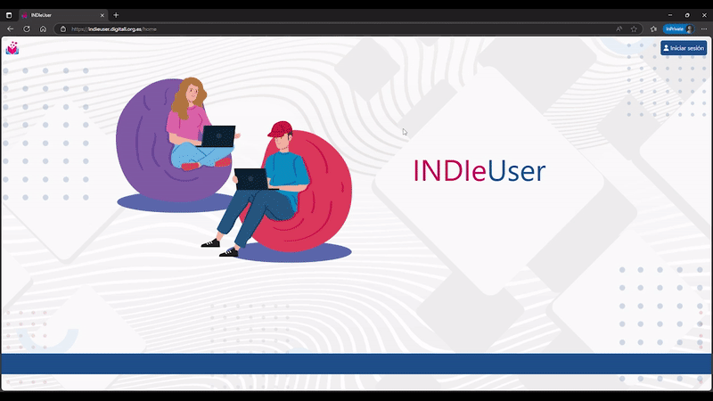
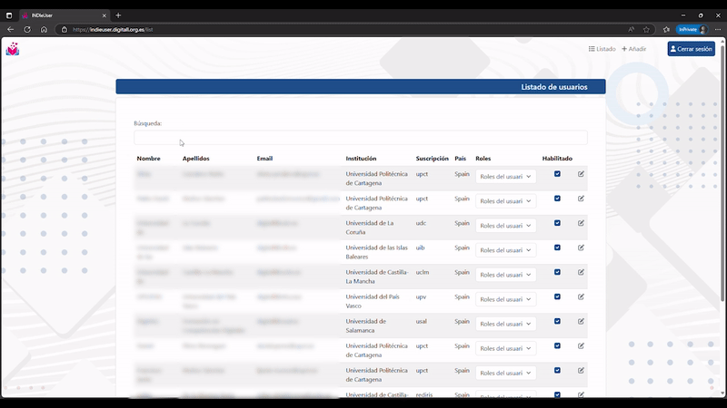

# INDIe User and Role Management Panel

A comprehensive frontend application for managing users, roles, and permissions within the INDIe (Interactive Digital Competence Assessment) platform. This project represents the initial version (v0) of the administrative interface that was later integrated into a production system used by 21 Spanish universities.

## Project Overview

This Angular-based application was developed as part of two Erasmus+ KA201 projects, **INDIe** (2018-1-ES01-KA201-050924) and **INDIe4ALL** (2020-1-ES01-KA201-083177), coordinated by Universidad Politécnica de Cartagena. The platform supports the **DigitALL initiative**, an EU-funded program designed to evaluate and certify digital competencies (A1 to C2 levels) across Spanish higher education institutions.

**Key Links:**
- [DigitALL Project](https://www.digitall.org.es/?lang=en)
- [INDIe Project](https://indieproject.upct.es/)

## Impact & Production Use

The frontend developed in this repository served as the foundation for the user management system that was subsequently:
- Integrated into a distributed Microsoft Azure microservices architecture
- Deployed across **21 Spanish universities** participating in the DigitALL/RedIRIS program
- Used for digital competency evaluation and certification at institutional scale

## Technical Implementation

### Technology Stack
- **Frontend Framework:** Angular CLI v16.1.3
- **Architecture:** Microservices-based system integration
- **Backend Communication:** RESTful API integration
- **Database:** MySQL (containerized environment)
- **Development Period:** July - September 2023

### Core Features
This CRUD application provides comprehensive administrative functionality:

- **User Management**
  - Create, read, update, and delete user accounts
  - Modify user profiles (email, password, personal information)
  - Secure password encryption and sensitive data handling

- **Role & Permission System**
  - Role assignment and management
  - Permission allocation and modification
  - Administrative access control

- **Administrative Interface**
  - Intuitive dashboard for system administrators
  - Streamlined workflow for user and role operations
  - Responsive design for various screen sizes

## Application Demo

### Authentication

### List and Edit Users

### Search Functionality

## Development Process & Challenges

This project was completed during my second year of studies as an autonomous development effort, with regular mentorship and weekly progress reports. Key challenges addressed include:

### Technical Learning Curve
- **Frontend Development:** First major Angular project, learning component architecture and TypeScript
- **Microservices Integration:** Understanding distributed system communication patterns
- **Database Operations:** Working with containerized MySQL databases and data modeling
- **API Integration:** Implementing secure communication with backend services

### Professional Development
- **Requirement Analysis:** Translating user needs into technical specifications
- **Security Implementation:** Implementing proper data encryption and secure handling practices
- **Deadline Management:** Delivering a functional v0 within a fixed timeline
- **Team Communication:** Regular reporting and mentorship coordination

## Project Context

### Educational Framework
This work was completed as part of university research projects focused on digital competency assessment. The application serves as the administrative backbone for:

- Digital skills evaluation platforms
- Institutional competency certification programs
- Multi-university collaboration tools
- Educational technology research initiatives

### Collaborative Development
While this repository contains the autonomous v0 development work, the project evolved through collaborative efforts:
- **v0 Development:** Independent frontend implementation (this repository)
- **Production Integration:** Team-based authentication and deployment implementation
- **Ongoing Maintenance:** Continued development by institutional teams

## Institutional Impact

The user management system developed here supports digital competency evaluation across major Spanish universities, contributing to:
- Standardized digital skills assessment
- EU-wide educational technology initiatives
- Cross-institutional collaboration platforms
- Research in digital competency frameworks

## Development Timeline

**Summer 2023 (July - September)**
- Requirements analysis and system design
- Angular application architecture setup
- Core CRUD functionality implementation
- User interface design and responsive implementation
- API integration and data flow setup
- Weekly progress reporting and mentorship meetings
- v0 delivery and handoff for production integration

## Related Projects

This frontend application is part of a larger ecosystem of educational technology tools:
- **INDIe Platform:** Interactive digital competence assessment framework
- **INDIe4All:** Extended accessibility and inclusivity features
- **DigitALL Initiative:** Spanish national digital competency certification program

---

**Note:** This repository represents a historical snapshot of the initial frontend development work. The production version has been enhanced with additional features including authentication systems and is maintained by the institutional development teams.
